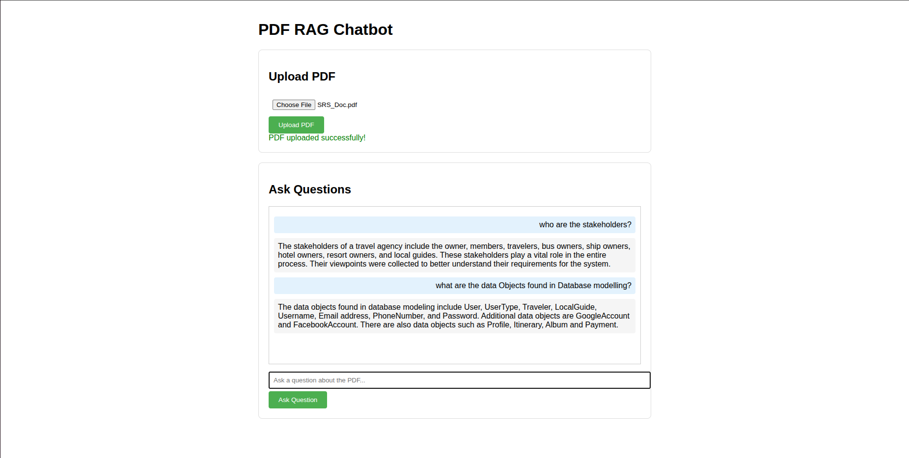

# PDF RAG Chatbot

A FastAPI-based chatbot that allows you to upload PDF documents and ask questions about their content using Google's Gemini AI and FAISS vector search.

## Demo



*The web interface showing PDF upload and chat functionality*

## Features

- Upload PDF files through a web interface
- Ask questions about the uploaded PDF content
- Real-time chat interface
- RAG (Retrieval-Augmented Generation) powered responses
- Vector search using FAISS
- Google Gemini AI for natural language understanding

## Setup

### 1. Install Dependencies

```bash
# Run the setup script
./setup.sh

# Or manually:
python3 -m venv venv
source venv/bin/activate
pip install -r requirements.txt
```

### 2. Set up Google API Key

You need a Google API key to use Gemini AI:

1. Go to [Google AI Studio](https://makersuite.google.com/app/apikey)
2. Create an API key
3. Set it as an environment variable:

```bash
export GOOGLE_API_KEY='your_api_key_here'
```

Or create a `.env` file:
```bash
cp .env.template .env
# Edit .env and add your API key
```

### 3. Run the Application

```bash
python chatbot_app.py
```

The application will start on `http://localhost:8000`

## Usage

1. Open your browser and go to `http://localhost:8000`
2. Upload a PDF file using the upload section
3. Wait for the processing to complete
4. Ask questions about the PDF content in the chat section
5. Get AI-powered answers based on the document content

## API Endpoints

- `GET /` - Web interface
- `POST /upload-pdf/` - Upload a PDF file
- `POST /ask-question/` - Ask a question about the uploaded PDF
- `GET /health` - Health check endpoint

## Example Questions

After uploading a PDF, you can ask questions like:
- "What is the main topic of this document?"
- "Who are the stakeholders mentioned?"
- "What are the key requirements?"
- "Summarize the document"

## Technology Stack

- **FastAPI** - Web framework
- **LangChain** - LLM framework
- **Google Gemini** - Large language model
- **FAISS** - Vector similarity search
- **PyPDF** - PDF processing
- **LangGraph** - Workflow orchestration

## Troubleshooting

1. **Import errors**: Make sure you've activated the virtual environment and installed all requirements
2. **API key errors**: Ensure your GOOGLE_API_KEY is set correctly
3. **PDF upload issues**: Check that the file is a valid PDF and not corrupted
4. **No responses**: Make sure you've uploaded a PDF first before asking questions
